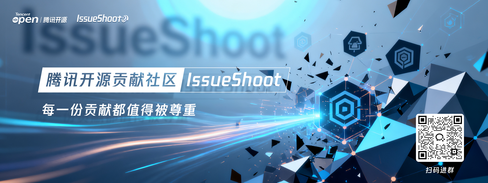

# 欢迎来到腾讯IssueShoot开源贡献社区

✌嗨！开发者朋友们，如果你想参与腾讯开源项目贡献，与腾讯技术大咖深入交流，那IssueShoot绝对是你的最佳选择 —— 一个让更多开发者参与腾讯开源贡献的社区。
## 01 什么是IssueShoot？

IssueShoot于2022年4月在腾讯内部诞生，2025年9月正式拓展到外部社区，至今已汇聚了千余名的贡献者。这些贡献者们有一个共同的名字——shooter（issue认领人）。你在IssueShoot贡献的每一次，都将得到充分的尊重和认可~

## 02 我要怎么参与？

1、 在【任务大厅】找到想要参与的项目

2、 点击【任务名称】链接，issue页面留言【我认领】即可。

3、 在规定时间内完成issue，待项目方审核通过，就可以累积【贡献力】啦！

注： 1、贡献力排名可按季度/年度兑换相应礼品、腾讯开源贡献者电子证书等，具体可关注赛季活动详情。 2、贡献还会记录在开放原子开源基金会上，具体可登陆查看[开放原子开源基金会人才评价系统](https://talent.openatom.cn/)

👉点击查看【shooter贡献力排行榜】（放榜单链接）

## 03 欢迎加群获取更多信息

## 任务大厅

项目名称： my-Oteam 项目激励：金币100 项目地址： https://github.com/issueshoot/testmd

| 状态             | issue 名称                   | 技术领域           | 难度         | 预估人天 | 期望完成时间 | 认领人           |
|:---------------|:---------------------------|:---------------|:-----------|:-----|:-------|:--------------| 
| 招募中 | [test 3](https://github.com/issueshoot/testmd/issues/3) | 研发效能 | 中 | 5 | 2025-08-27 |  |  
| 招募中 | [test 5](https://github.com/issueshoot/testmd/issues/5) | 研发效能 | 中 | 6 | 2025-08-27 |  |  
| 招募中 | [test 6](https://github.com/issueshoot/testmd/issues/6) | 研发效能 | 中 | 6 | 2025-08-27 |  |  
| 招募中 | [test 7](https://github.com/issueshoot/testmd/issues/7) | 研发效能 | 中 | 6 | 2025-08-27 |  |  
| 招募中 | [test 2](https://github.com/issueshoot/testmd/issues/2) | 研发效能 | 中 | 6 | 2025-08-27 |  |  

